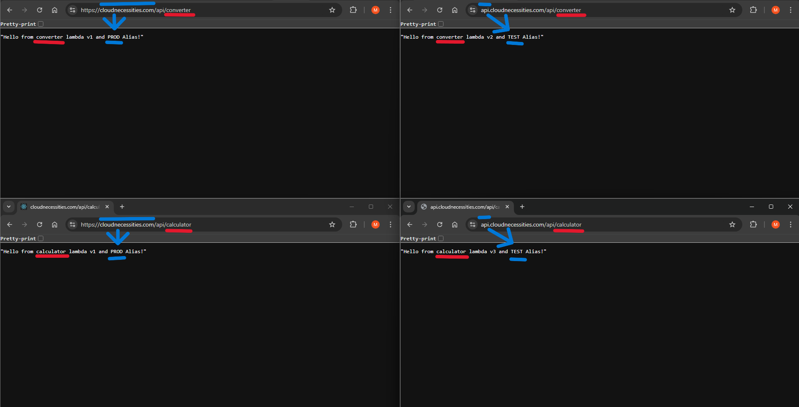
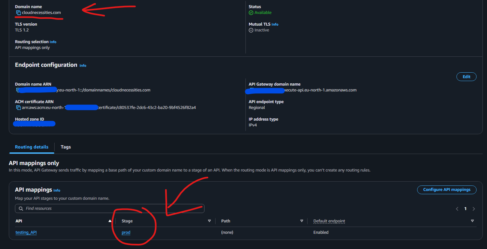

# API Gateway + 3 Lambdas + 3 Environments (prod/test/dev) with Custom Domains

This README documents a hands-on setup where a single **REST API Gateway** routes to **three Lambda functions**—`calculator`, `tax`, and `converter`—across **three environments** via **Lambda aliases** (`PROD`, `TEST`, `DEV`) and **stage variables**. It also covers mapping the API to my own domains: **cloudnecessities.com** and **api.cloudnecessities.com**.

---


## What I built

- **3 Lambda functions**: `testing-api-calculator`, `testing-api-tax`, `testing-api-converter`
- **3 aliases per function**: `PROD`, `TEST`, `DEV` (pointing to different **published versions** or **LATEST**)
- **1 REST API** with resources:
  - `/api/calculator`
  - `/api/tax`
  - `/api/converter`
- **3 stages** in API Gateway: `prod`, `test`, `dev`
- **Stage variables** per stage, one per route:
  - `calcAlias`, `taxAlias`, `convAlias`
- **Custom domains (Regional)** in API Gateway:
  - `cloudnecessities.com` → mapped to stage **prod**
  - `api.cloudnecessities.com` → mapped to stage **test** (as an example)
- **ACM certificates** in **eu-north-1** for Regional API Gateway
  - Note: **CloudFront** requires ACM certs in **us-east-1**

  

---

## Architecture

```
Client (curl / browser)
   |
   |  https://cloudnecessities.com/api/...     https://api.cloudnecessities.com/api/...
   |            (maps to prod)                       (maps to test, example)
   v
API Gateway Custom Domains (Regional)
   ├── Base path mapping → REST API → Stage: prod/test/dev
   │
   └── REST API resources:
        /api/calculator   → Lambda: testing-api-calculator : ${stageVariables.calcAlias}
        /api/tax          → Lambda: testing-api-tax        : ${stageVariables.taxAlias}
        /api/converter    → Lambda: testing-api-converter  : ${stageVariables.convAlias}
                                     ^ per-stage variables (e.g., PROD/TEST/DEV alias)
```

---

## Naming used

- **Lambda functions**  
  - `testing-api-calculator`  
  - `testing-api-tax`  
  - `testing-api-converter`
- **Lambda aliases**: `PROD`, `TEST`, `DEV`  
  (Aliases are **case-sensitive**. Use the exact casing everywhere: in stage variables and permissions.)
- **API stages**: `prod`, `test`, `dev` (stage names are independent from alias names/casing)
- **Stage variables** (one per route): `calcAlias`, `taxAlias`, `convAlias`

---

## Lambda: simple handler 

```python
import json

def lambda_handler(event, context):
    body = "Hello from Calculator Lambda v1 and PROD Alias!"
    return {
        "statusCode": 200,
        "headers": {"Content-Type": "application/json"},
        "body": json.dumps(body),
    }
```

Publish a **version** for each function and create **aliases** `PROD`, `TEST`, `DEV` pointing to the versions you want.

---

## API Gateway resources & integration (per route)

Resources I created:
```
/api/calculator   (GET)
/api/tax          (GET)
/api/converter    (GET)
```

 

For each method’s **Integration Request → URI**, reference the **stage variable** for that route’s alias:

- **tax** route:
  ```
  arn:aws:apigateway:eu-north-1:lambda:path/2015-03-31/functions/
  arn:aws:lambda:eu-north-1:123456789123:function:testing-api-tax:${stageVariables.taxAlias}/invocations
  ```

- **calculator** route:
  ```
  arn:aws:apigateway:eu-north-1:lambda:path/2015-03-31/functions/
  arn:aws:lambda:eu-north-1:123456789123:function:testing-api-calculator:${stageVariables.calcAlias}/invocations
  ```

- **converter** route:
  ```
  arn:aws:apigateway:eu-north-1:lambda:path/2015-03-31/functions/
  arn:aws:lambda:eu-north-1:123456789123:function:testing-api-converter:${stageVariables.convAlias}/invocations
  ```

> **Proxy integration** can be enabled; the above URIs work with or without proxy, as long as you use the correct Lambda **ARN** with the alias placeholder.

 

---

## Stages & stage variables

Create three **stages**: `prod`, `test`, `dev`.  
Set **stage variables** (matching my alias names exactly). Example with **uppercase aliases**:

**prod stage**
```
calcAlias = PROD
taxAlias  = PROD
convAlias = PROD
```

**test stage**
```
calcAlias = TEST
taxAlias  = TEST
convAlias = TEST
```

**dev stage**
```
calcAlias = DEV
taxAlias  = DEV
convAlias = DEV
```


---

## Lambda invoke permissions (least privilege)

Grant API Gateway permission to invoke each **alias** per **stage + method + path**.  
**Example (calculator, prod stage):**

```bash
aws lambda add-permission \
--function-name "arn:aws:lambda:eu-north-1:123456789123:function:testing-api-calculator:PROD" \
--source-arn "arn:aws:execute-api:eu-north-1:123456789123:ybcl85352e/*/GET/api/calculator" \
--principal apigateway.amazonaws.com \
--statement-id fbf736bc-c00f-4b79-8f5f-5201d6fe740d \
--action lambda:InvokeFunction
```

Repeat for **tax** and **converter**, and for **test/dev** stages (swap `PROD` → `TEST`/`DEV` and `prod` → `test`/`dev`).

---

## Testing

```bash
curl -i "https://<API_ID>.execute-api.eu-north-1.amazonaws.com/prod/api/calculator"
curl -i "https://<API_ID>.execute-api.eu-north-1.amazonaws.com/test/api/tax"
curl -i "https://<API_ID>.execute-api.eu-north-1.amazonaws.com/dev/api/converter"
```

I can also map custom domains (below) to hide the stage in public URLs.

---

## Custom domains (Regional) + DNS

I created two **Regional** custom domains in API Gateway and attached **eu-north-1** ACM certs:

- `cloudnecessities.com` → mapped to stage **prod** 



- `api.cloudnecessities.com` → mapped to stage **test** 


**Route 53**: create **A Alias** records pointing to the API Gateway **Regional domain name** (shown on the custom domain page), not to CloudFront.

**URLs** :
- `https://api.cloudnecessities.com/api/converter`  → (test)
- `https://cloudnecessities.com/api/calculator`     → (prod)

> **Certificates**:  
> - API Gateway **Regional** → cert in the **same region** (eu-north-1).  
> - If you front with **CloudFront**, that distribution’s cert must be in **us-east-1**.


---

## Promotion & rollback

- **Promote**: publish a new Lambda version and update the **alias** (`PROD`/`TEST`/`DEV`) to the new version. No API changes or redeploy needed.
- **Rollback**: point the alias back to the previous version.
- **Canary** (optional): use Lambda alias weights or API Gateway stage canaries to shift a % of traffic before full promotion.


---

## Extra notes from this hands-on

- I intentionally used **3 Lambdas** × **3 environments** to understand routing and promotion. ✅
- I tested each environment’s URL to confirm it calls the correct **alias/version**. ✅
- I linked **two domains** to the same API, mapping each to a different stage to simulate **prod** vs **test**. ✅
- I verified that for **CloudFront** you’d need certs in **us-east-1** (N. Virginia), while API Gateway **Regional** uses **eu-north-1** certs. ✅

#AWS #Serverless #APIGateway #AWSLambda #RESTAPI #InfrastructureAsCode #CloudArchitecture #DevOps #CICD #CloudFront #Route53 #ACM #CustomDomain #DNS #APIVersioning #Stages #Aliases #AWSCertified #BuiltOnAWS
