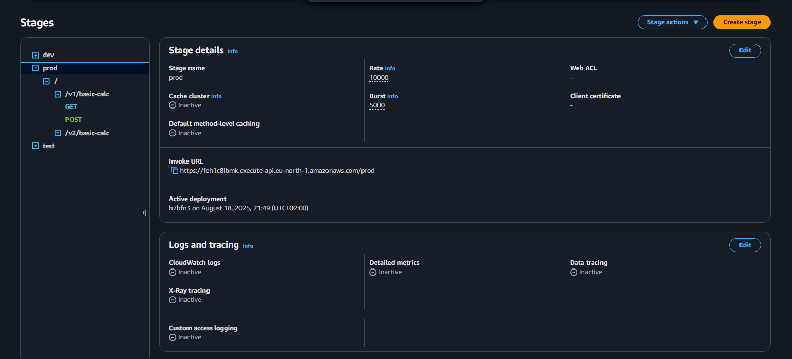
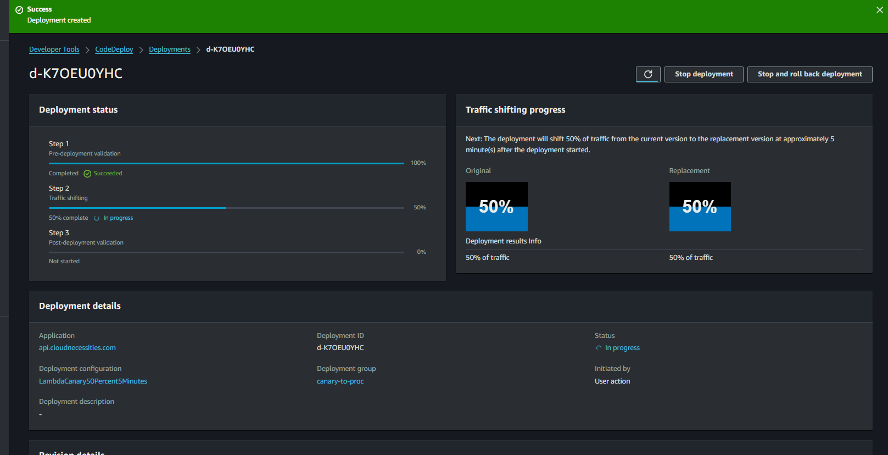
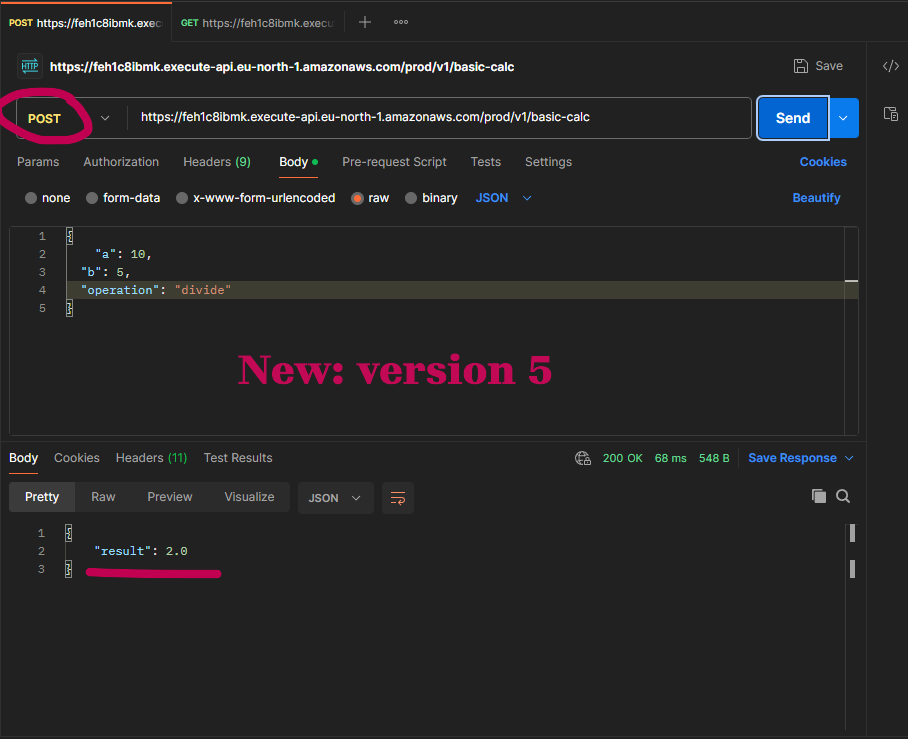
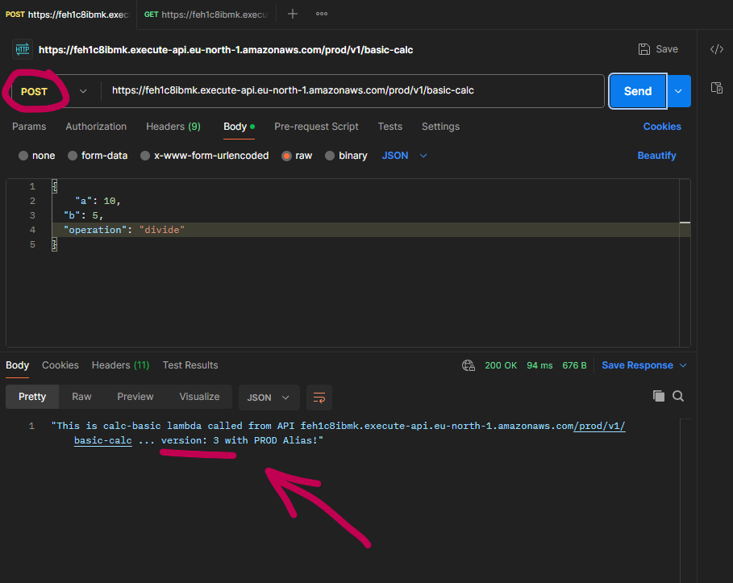
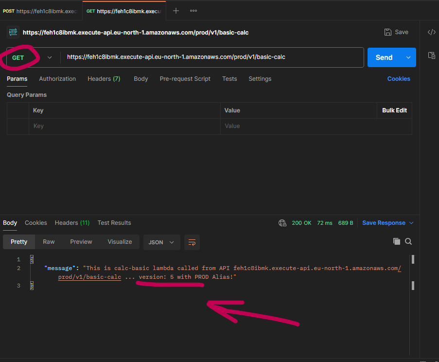
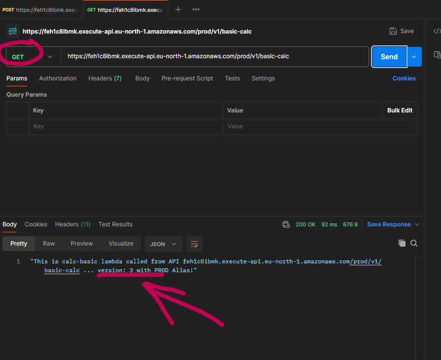
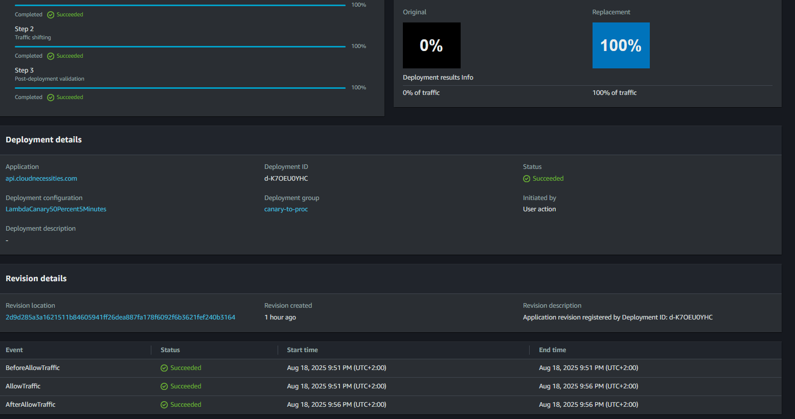
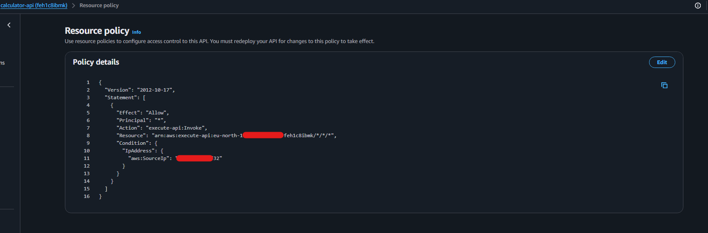

# 🧮 NetCalculator API – Versioned Deployment with Canary Release

This repository documents my experiment with **service-based APIs** on AWS using **API Gateway + Lambda + CodeDeploy**.  
The goal was to design an API setup that can **scale**, support **multiple versions in parallel**, and allow **safe rollouts** without downtime.

---

## 📌 Project Overview

I wanted to test **how to introduce new methods (GET + POST)** into an API while ensuring:

- **Multiple versions (v1, v2, …) can run live at the same time**  
- **Stage variables** control which Lambda alias gets invoked  
- **Traffic shifting** can be done safely using Lambda aliases or CodeDeploy  
- **Errors can be caught early** when introducing new methods  
- **Testing happens first in dev/test stages** before pushing to production  

This setup mirrors how teams scale APIs in production while avoiding hitting hard limitations later.

---

## ⚙️ Architecture

- **API Gateway** (service-based API, regional endpoint)  
  - Stages: `dev`, `test`, `prod`  
  - Stage variables to dynamically resolve Lambda aliases  
  - Resources:  
    - `v1/basic-calc` (`GET`, `POST`)  
    - `v1/scientific-calc` (`GET`)  
    - Future: `v2/*`  

- **Lambda**  
  - Function: `calculatorLambda`  
  - Versions: `v3`, `v4`, `v5`, …  
  - Aliases: `devAlias`, `testAlias`, `prodAlias`  
  - Code detects `GET` vs `POST` methods:  
    - `GET` → simple response  
    - `POST` → parse JSON body for calculation  

- **CodeDeploy**  
  - Used for automated **canary deployments**  
  - Deployment group uses **tags** for API + Lambda integration  
  - Canary config: *50% traffic for 5 minutes* (for fast testing purposes)
  - Automatic rollback if errors detected  

---

## 🛠 Workflow (Step by Step)

### 1. Develop & Test in `dev`
- First, deployed code directly to Lambda **`$LATEST`**.
- Next, deployed API to `dev` stage.
- API Gateway `dev` stage pointed to `$LATEST`.
- Used **Postman** to test:
  - `GET /v1/basic-calc` → returns default response
  - `POST /v1/basic-calc` with JSON body → returns calculated result

✅ Confirmed logic works in dev.

---

### 2. Publish & Test with Manual Traffic Shifting
- After validating in `dev`, published a new **Lambda version (v5)**.  
- Updated alias `testAlias` → points to v5 with manual traffic shifting.  
- Deployed API to the `test` stage, which points to `testAlias`.  
- In `test`, experimented with **manual traffic shifting** by adjusting alias weights:  
  - Example:  
    - 50% → old version  
    - 50% → new version  
- Postman requests returned mixed responses depending on which version was hit (as expected).  

✅ Confirmed both the new POST method and **alias-based canary** worked correctly in the `test` stage.

---

### 3. Deploy API to Production
- Once testing was complete, `prodAlias` to continue pointing to the last stable version (v3).  
- Deployed API to the `prod` stage, which points to `prodAlias`.  

✅ Production stage ready for controlled rollout.

---

### 4. Automated Canary Deployment with CodeDeploy
- Set up **CodeDeploy application** for Lambda.  
- Deployment group used **tags** on Lambda functions.  
- Configured **canary release: 50% traffic for 5 minutes** (for fast testing purposes).  
- During rollout, Postman showed alternating responses between old and new code.  
- CodeDeploy handled shifting from version (v3) to (v5) + rollback safety automatically.  

✅ Successful end-to-end deployment pipeline with automated rollback protection.

---

### 5. Securing the API (Resource Policy)
- Added an **API Gateway resource policy** to restrict access.  
- Allowed **only my own IP** to invoke the API (for testing purposes).  
- Tested `GET` through my phone — confirmed requests from other IPs were blocked.  

✅ API secured with resource-level restriction.

---

## 🧑‍💻 Permissions Issue I Discovered

When I first created the new `POST` method, I assumed the **IAM permissions from GET would apply**.  
But API Gateway requires **separate permission entries** for each method + resource path.  

For example:  

- `arn:aws:execute-api:...:GET/v1/basic-calc`  
- `arn:aws:execute-api:...:POST/v1/basic-calc`  

Without adding the `POST` permission explicitly, the method failed until corrected.  
This was an important learning point about **per-method execution permissions**.

I also had a little issue with `Resource Policy`.

When I saved the policy, at first it didn't work. I realized I need to **deploy the API** again for the changes to take effect.

---

## ✅ Key Learnings

- API Gateway methods **do not share permissions** — each needs its own execution role entry.  
- **Stage variables + Lambda aliases** give a clean way to isolate `dev`, `test`, and `prod`.  
- **Canary deployments** can be done manually (via alias weights) or automated (via CodeDeploy)(blue/green).  
- CodeDeploy provides **automatic rollback safety**, useful for production scenarios.  
- Postman is a simple and effective way to test **GET** and **POST** requests with headers + JSON body.  
- Always redeploy API to **apply changes**.

---

## Final Flow

DEV → TEST (manual shifting on alias) → PROD (CodeDeploy canary)

- **DEV** → validate logic with GET/POST.  
- **TEST** → manual alias traffic shifting (50/50).  
- **PROD** → CodeDeploy automated canary with rollback.  
- **Resource Policy** → locked down to my IP.

## 📂 Repository Contents

- `README.md` – this documentation  
- ([Screenshots](Screenshots), [appspec.yaml](appspec.yaml), [Lambda code](lambda_function.py))  

---

#AWS #Serverless #Lambda #APIGateway #CodeDeploy #CanaryDeployment #DevOps #CloudComputing #CICD #InfrastructureAsCode #Postman #ResourcePolicy #ScalableAPI #AWSSolutionsArchitect
